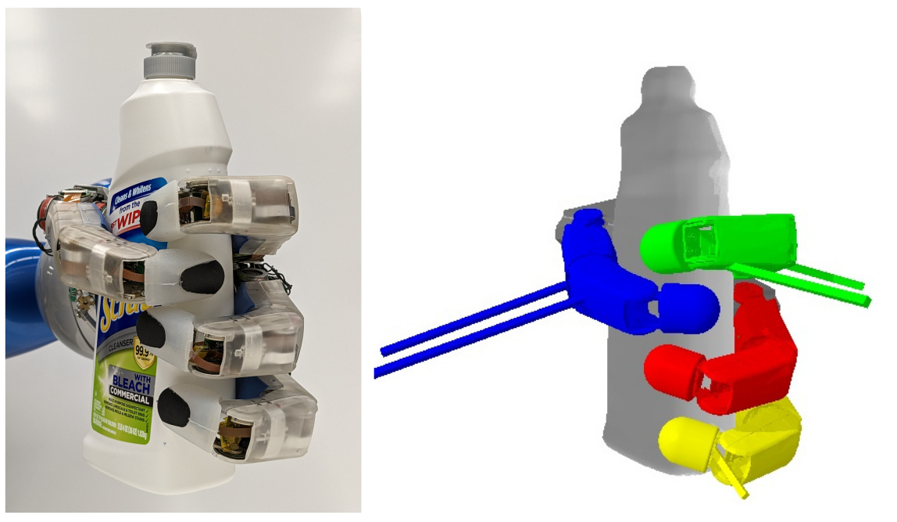

---
This site complements our research on grasping. 
For more information, please refer to one of the papers below.

### [Learning-based Real-time Torque Prediction for Grasping Unknown Objects with a Multi-Fingered Hand](_pages/iros23.md)
IROS 2023 by
[Dominik Winkelbauer](https://scholar.google.com/citations?hl=en&user=kduGd8wAAAAJ){:target="_blank"}, [Berthold Bäuml](https://scholar.google.com/citations?hl=en&user=SuOUxjUAAAAJ){:target="_blank"} and [Rudolph Triebel](https://scholar.google.com/citations?hl=en&user=fjvpDsEAAAAJ){:target="_blank"}.

<!---
[Full Paper](https://arxiv.org/abs/2303.04705){:target="_blank"} / [Video](https://www.youtube.com/watch?v=0VvSIvtHTq0){:target="_blank"}

-->

